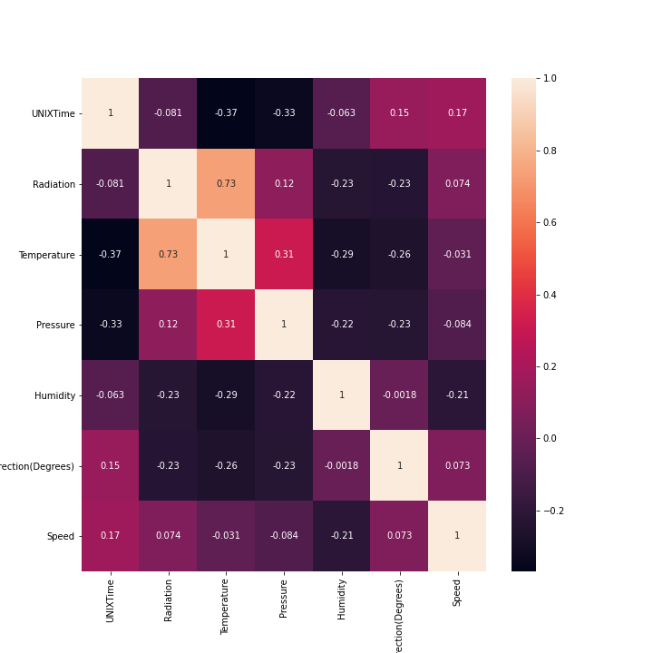

# Solar-Radiation-Prediction
Predict the level of solar radiation based on dataset given from NASA

This was a task from past NASA hackathon. I got this dataset from Kaggle. The main task is to predict Solar Radiation level based on given data. The dataset contains columns as: "pressure", "wind direction", "wind speed", "humidity" and temperature. The response parameter that is to be predicted is: "Solar_radiation". It contains measurements for the past 4 months and you have to predict the level of solar radiation.

if we able to predict the Radiation level with good accuracy, positioning of Solar panels could benefit into more energy results into less dependency on non renewable energy sources.

Given dataset was clean and dint need any data cleaning. With the pair plots I found that there is high correlation between Solar Radiation and Tempreture.

I have used adaptive boosting method for this regression problem which resulted into 92% r2-score

